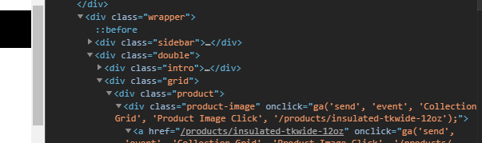
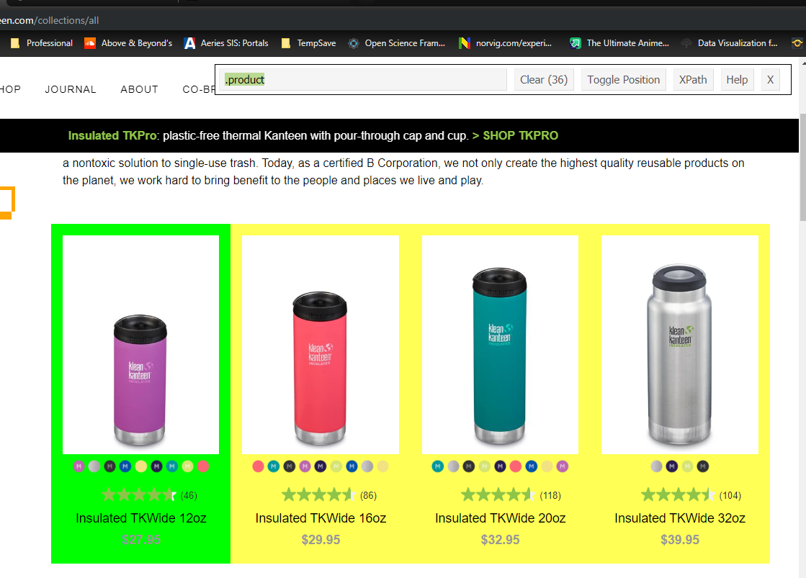

# Setup


## Learning material 

* https://stat545.com, chapter 39
* https://www.r-bloggers.com/practical-introduction-to-web-scraping-in-r/
* https://www.business-science.io/code-tools/2019/10/07/rvest-web-scraping.html
  - Note that a student wrote this one! By the end of the class you should be able to do this. 
* https://blog.rsquaredacademy.com/web-scraping/


## Required Packages

* `vignette("selectorgadget")`
* Drag link to bookmarks bar

OR Install this Google Chrome extension https://selectorgadget.com/
* goto https://chrome.google.com/webstore/search/selector%20gadget and add to chrome


```{r}
library(tidyverse) #dplyr, magrittr, tidyr, ggplot, lubridate, purrr etc. 
library(rvest)
library(stringr)
#library(selectr)
```


# Home prices

```{r}
rtxt <- robotstxt::robotstxt("https://www.realtor.com/")
rtxt$check(paths = c("/","api/"), bot = "*")
```

A TRUE value means it's ok to crawl through this folder. 
You can also check a URL here: https://technicalseo.com/tools/robots-txt/ 

Read all the HTML from that page into an object in R. 
```{r}
chico <- read_html("https://www.realtor.com/realestateandhomes-search/Chico_CA?cid=prt_bestplaces_ppmenu_text")
```

Find html node name for the thing I want to get






extract details from card. convert to text, squish out whitespace
```{r}
details <- chico %>% html_nodes(".detail-wrap") %>% html_text() %>% str_squish()

# put into a data frame
dta <- data.frame(details, stringsAsFactors = FALSE)
```

I started by extracting one piece at a time, But some cards didn't have some info (like lot size), so I was getting different vector sizes. (not evaluated)
```{r, eval=FALSE}
data.value <- chico %>% html_nodes(".data-value")
lot.label <- chico %>% html_node(".lot-label") %>% html_text()
price <- chico %>% html_nodes(".data-price") %>% html_text()
```

**get details -- uses regex**
Find the dollar amounts, remove the `$` and `,` symbols, convert to numeric, store as new variable. 
https://regex101.com/

```{r}
str_extract(dta$details, "\\$[0-9,]+") %>% str_remove_all("[\\$,]") %>% as.numeric() -> dta$price
str_extract(dta$details, "\\d bed") %>% str_replace(" bed", "") %>% as.numeric() -> dta$bed
str_extract(dta$details, "\\d bath") %>% str_replace(" bath", "") %>% as.numeric() -> dta$bath
```

```{r}
ggplot(dta, aes(y=price, fill=as.factor(bed))) + geom_boxplot()
```


